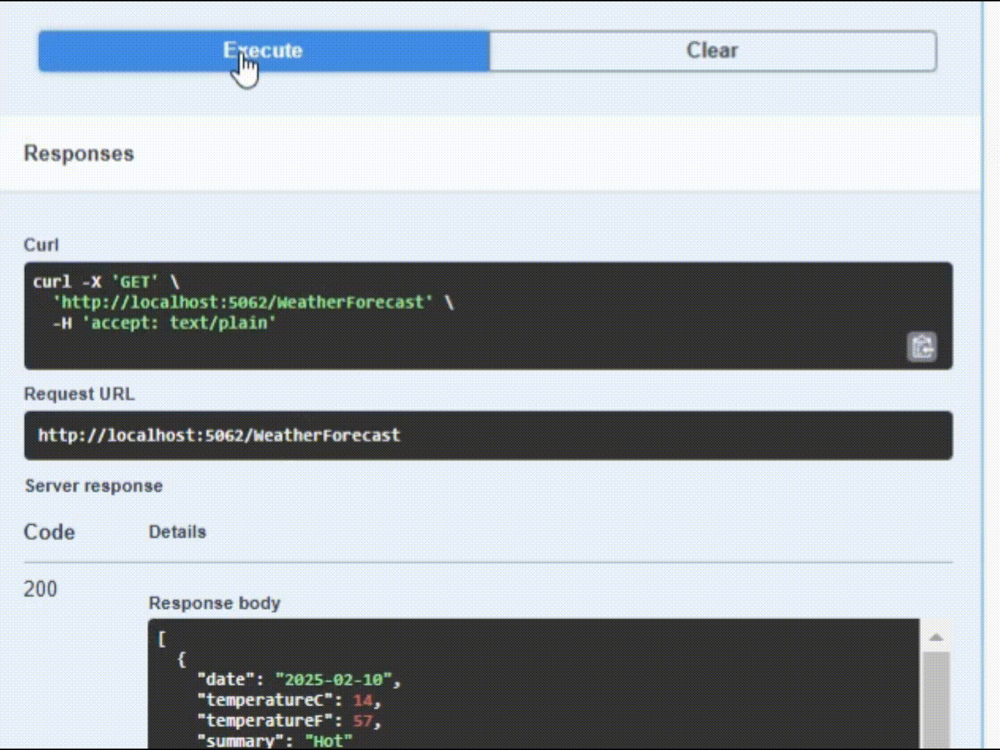

# RateLimiter.Redis
This library helps protect your API from excessive requests by implementing rate limiting with Redis (or local caching).



## Features

- IP-based rate limiting to control excessive API requests.
- Customizable rate limiting policies based on request limits and time windows.
- Easy integration with ASP.NET Core middleware.

## Usage

Install the package from NuGet:
```
dotnet add package RateLimiter.Redis
```

Add the rate limiter services in `Program.cs`:

```csharp
builder.Services.AddLimiter(redisConnection: "localhost:1453", options =>
{
    options.CacheType = CacheType.Redis;
    options.MaxRequestCount = 10;
    options.TimeInterval = TimeSpan.FromSeconds(100);
});
```
and
```csharp
app.UseLimiter();
```

The middleware automatically restricts API requests based on the configured limits. If a client exceeds the limit, they receive a 429 Too Many Requests response.
